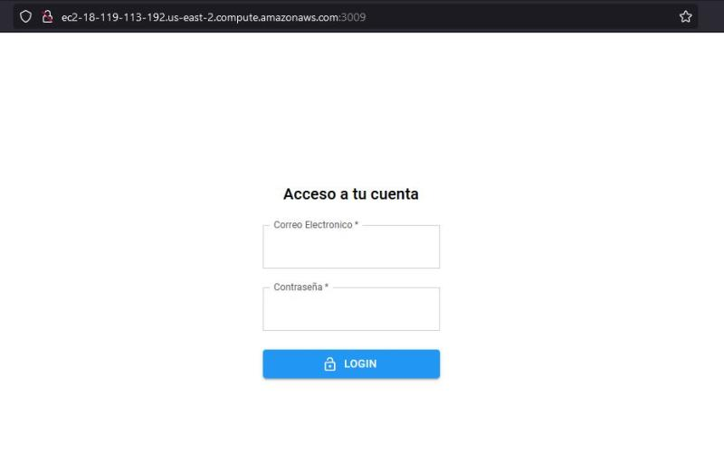
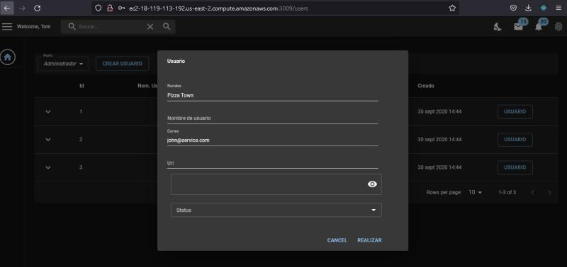
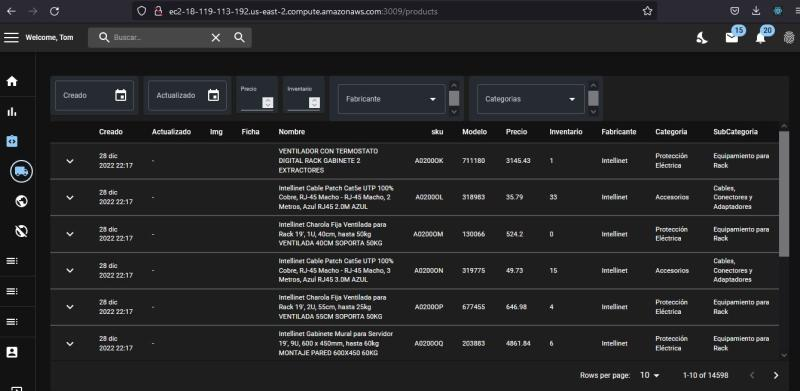
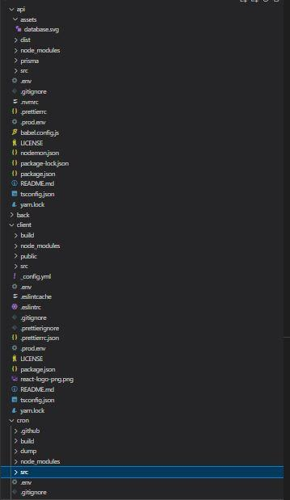
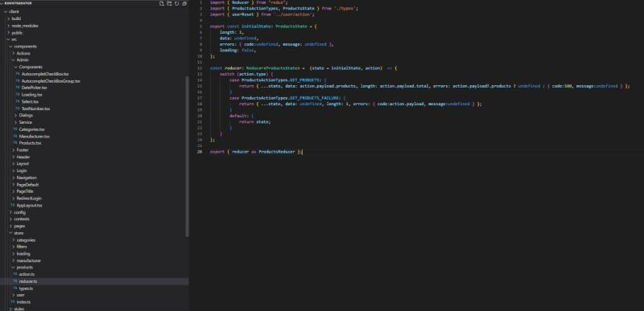
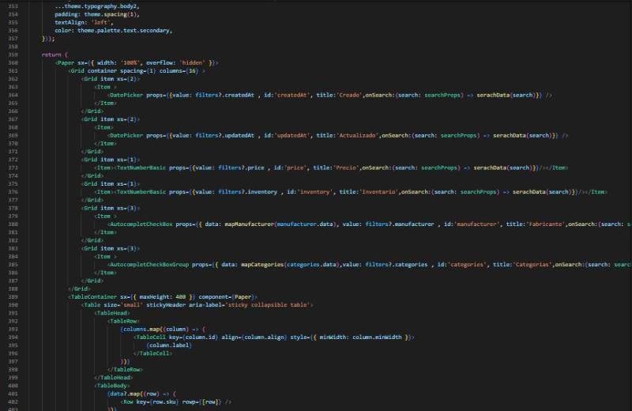
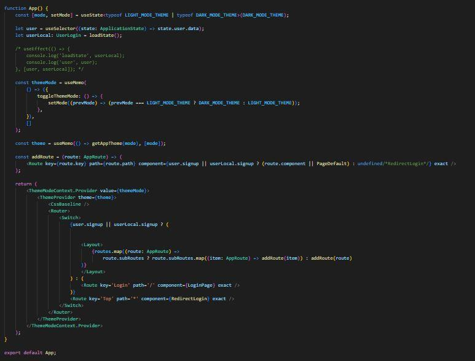

# AdminShop

    <a target="_blank" href="http://ec2-18-119-113-192.us-east-2.compute.amazonaws.com:3009/">
        Link
    </a>
    
user: john@customer.com

    
user: john@service.com

    
pass: pass

React, postgres, prisma, node: client, api, cron

#